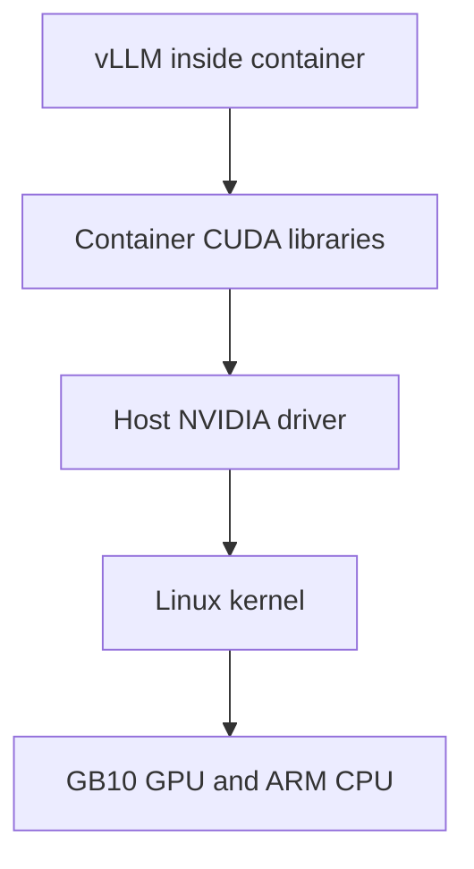
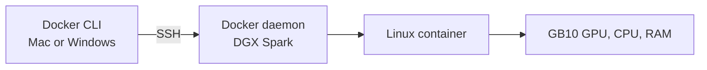
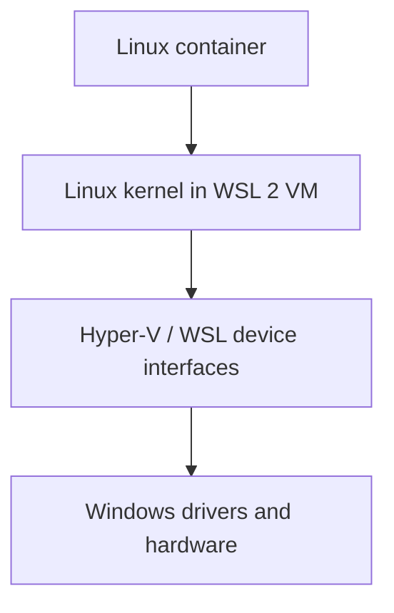
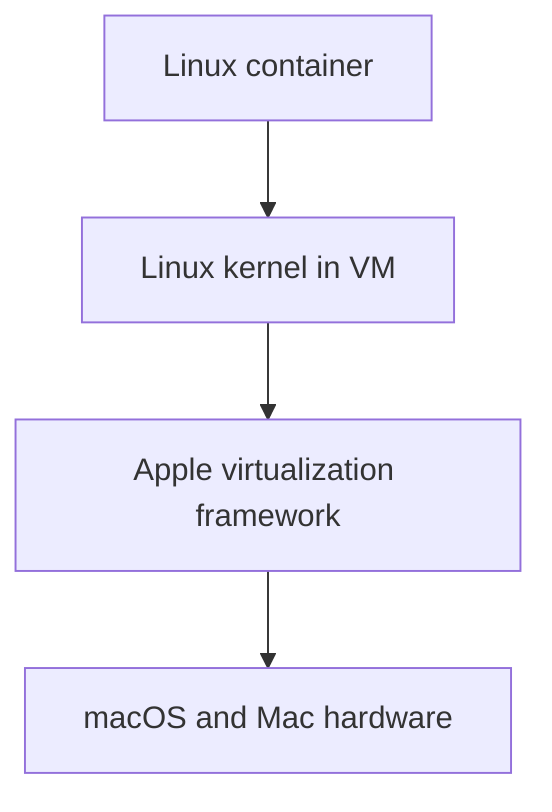
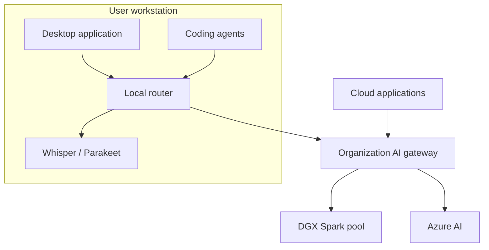

So i had this convo with an LLM a while ago:

----------------

I was researching LLM serving and embeddings on the DGX Spark and the model I was talking to cane up with these ideas, saying to run docker container:

The NVIDIA DGX Spark (and its OEM equivalent, the RTX Spark) is built around the GB10 Grace Blackwell Superchip. It is essentially a small-form-factor "AI mini-PC" featuring a 20-core ARM CPU and a Blackwell GPU sharing 128 GB of unified system memory. [1, 2, 3]

## Because it uses unified memory (similar to an Apple Mac Studio Ultra) rather than ultra-fast dedicated HBM/GDDR VRAM, its memory bandwidth sits around 273 GB/s. This makes it fantastic for fitting massive models into RAM cheaply, but means you have to be tactical about model selection and resource allocation to handle many network users and nightly batch pipelines. [4, 5, 6, 7]

## 1. Model Sizing: What is the Absolute Max?

With 128 GB of unified memory, your absolute upper bound is dictated by how heavily you are willing to quantize the model. [8]

-
- The Safe Sweet Spot: 70B to 90B Models (Quantized)
- Models like Llama-3.1 70B or Mistral Large run comfortably if you use FP8 or 4-bit (INT4/NVFP4) quantization. A 70B model at 4-bit precision takes up roughly 40–45 GB of RAM. This leaves you plenty of leftover memory (~70+ GB) to act as a KV Cache to support your daytime concurrent users. [8, 9, 10]
- The "Can Do" Max: 120B to 235B Mixture-of-Experts (MoE)
- The Spark explicitly lists software support for models up to 200B+ parameters. However, dense 120B models run quite slowly due to the 273 GB/s memory bandwidth bottleneck.
  - Instead, look at Mixture-of-Experts (MoE) models (e.g., Mixtral 8x22B or Qwen 2.5/3.5 MoE variants). MoEs keep the entire model in RAM, but only route a user's prompt through a fraction of the parameters per token. They give you the smarts of a 140B+ model but execute with the speed of a much smaller model. [5, 11, 12, 13, 14]
-

----------------

## 2. Managing the Shift: Daytime Serving vs. Nightly Batching

Because the DGX Spark shares its 128 GB across everything, you cannot leave a massive 120B model completely active in RAM while simultaneously trying to run heavy document processing, OCR, and embedding pipelines at night. You will get out-of-memory (OOM) crashes. [8, 15, 16, 17]
To make this work seamlessly, you need to set up automated workflow orchestration:

## The Daytime Shift (User Inference)

-
- The Stack: Run vLLM (which has official playbook optimization guides pre-packaged for the [DGX Spark ecosystem](https://build.nvidia.com/spark)).
- The Setup: Dedicate 45 GB to your quantized 70B LLM and allocate another 50-60 GB strictly to vLLM's gpu_memory_utilization to handle the PagedAttention KV cache for your concurrent network users. [8, 9, 18, 19]
-

## The Nightly Shift (OCR, Document Chunking, Embeddings) [20, 21, 22]

At a designated time (e.g., 11:00 PM), a simple cron-job script should automatically spin down or reduce the primary LLM's footprint to free up the system's 128 GB of unified RAM. [8]

[ Day Shift: 8 AM - 11 PM ] [ Night Shift: 11 PM - 8 AM ]
┌──────────────────────────────┐            ┌──────────────────────────────┐
│ vLLM (70B/90B LLM Active) │ ──► │ • Small LLM/Embedding Model │
│ Max KV Cache for Users │ (Cron)    │ • Unstructured / Tesseract │
│ Memory: ~110 GB allocated │            │ • Document Parsing & OCR │
└──────────────────────────────┘            └──────────────────────────────┘

1. OCR Operations: Tools like Tesseract OCR or PaddleOCR are heavily CPU and memory-bound. By reducing your LLM footprint, you allow the 20-core ARM Grace CPU to chew through document PDFs without hitting memory limits. [3, 4]
2. Embedding & Ingestion: You can drop the main LLM completely and spin up a lightweight embedding model (like bge-large-en or nomic-embed-text) which takes up less than 2 GB of RAM. You can then stream your newly OCR'd text into a vector database (like Qdrant or Milvus) hosted right on the Spark's internal 4TB NVMe SSD. [1, 20, 23, 24, 25]
3. Morning Spin-up: At 7:00 AM, the cron job kills the batch scripts and re-launches the large vLLM instance, making it fresh and ready for network users starting their workday.

----------------

## Recommended Deployment Blueprint

-
- Primary Daytime LLM: Llama-3.1-70B-Instruct (Quantized to FP8 or INT4/NVFP4 to optimize for Blackwell's 5th-Gen Tensor Cores).
- Daytime Inference Server: vLLM or TensorRT-LLM (NVIDIA provides optimized TensorRT-LLM scripts out of the box for the DGX Spark).
- Nightly Automation: A bash script utilizing docker stop vllm-server ➔ executes python/OCR batch workers ➔ executes docker start vllm-server. [4, 8, 18, 26, 27]
-

If you would like, I can help you draft a Python or Bash template script that automates the nightly container shutdown, triggers document parsing, and reloads the main LLM in the morning. Let me know if that would be useful!

[1] [https://www.corsair.com](https://www.corsair.com/us/en/explorer/gamer/gaming-pcs/what-is-nvidia-dgx-spark/)
[2] [https://www.mindstudio.ai](https://www.mindstudio.ai/blog/what-is-rtx-spark-nvidia-ai-chip-local-inference)
[3] [https://www.digitalapplied.com](https://www.digitalapplied.com/blog/nvidia-rtx-spark-local-120b-agent-superchip-2026-guide)
[4] [https://docs.nvidia.com](https://docs.nvidia.com/dgx/dgx-spark/hardware.html)
[5] [https://www.reddit.com](https://www.reddit.com/r/StableDiffusion/comments/1pe3uyv/nvidia_dgx_spark_anybody_has_tried_it_for_image/)
[6] [https://www.reddit.com](https://www.reddit.com/r/StableDiffusion/comments/1qb22co/ltxv2_dgx_compute_box_and_about_30_hours_over_a/)
[7] [https://medium.com](https://medium.com/@ttio2tech_28094/nvidias-dgx-spark-is-here-and-it-s-not-the-gpu-you-think-it-is-66514387920e)
[8] [https://spark.enverge.ai](https://spark.enverge.ai/blog/what-fits-in-128gb-dgx-spark)
[9] [https://developer.nvidia.com](https://developer.nvidia.com/blog/new-software-and-model-optimizations-supercharge-nvidia-dgx-spark/)
[10] [https://apxml.com](https://apxml.com/posts/best-local-llm-rtx-40-gpu)
[11] [https://www.leadtek.com](https://www.leadtek.com/eng/products/ai_hpc%2837%29/nvidia_dgx_spark_founders_edition%2851035%29/detail)
[12] [https://forums.developer.nvidia.com](https://forums.developer.nvidia.com/t/can-someone-please-just-help-me-set-the-dgx-spark-up-for-optimal-llm-use/373320)
[13] [https://www.reddit.com](https://www.reddit.com/r/LocalLLaMA/comments/1os5uur/locally_running_llms_on_dgx_spark_as_an_attorney/)
[14] [https://www.reddit.com](https://www.reddit.com/r/LocalLLM/comments/1tkxt64/16x_dgx_sparks/)
[15] [https://www.youtube.com](https://www.youtube.com/watch?v=I2dFW8L2jLQ&t=178)
[16] [https://forums.developer.nvidia.com](https://forums.developer.nvidia.com/t/dgx-spark-gb10-reproducibly-hard-powers-off-under-gpu-load-fully-updated-zero-crash-capture/373251)
[17] [https://sparktastic.hashnode.dev](https://sparktastic.hashnode.dev/qwen3-vl-image-analysis-using-vllm-on-dgx-spark)
[18] [https://build.nvidia.com](https://build.nvidia.com/spark)
[19] [https://skorppio.com](https://skorppio.com/blog/dgx-spark-vs-mac-studio-efficiency-benchmark)
[20] [https://vast.ai](https://vast.ai/article/the-nvidia-dgx-spark-the-new-desktop-ai-supercomputer-that-fits-in-your-hand)
[21] [https://www.linkedin.com](https://www.linkedin.com/posts/krehlik_nvidias-compact-dgx-spark-ai-supercomputer-activity-7466812163765100544-uaPH)
[22] [https://medium.com](https://medium.com/sparktastic/starting-with-a-spark-d9a8a03c0387)
[23] [https://forums.developer.nvidia.com](https://forums.developer.nvidia.com/t/building-local-hybrid-llms-on-dgx-spark-that-outperform-top-cloud-models/359569)
[24] [https://jefftech.substack.com](https://jefftech.substack.com/p/nvidia-dgx-spark-the-mini-ai-supercomputer)
[25] [https://medium.com](https://medium.com/sparktastic/starting-with-a-spark-d9a8a03c0387)
[26] [https://wisp.net.au](https://wisp.net.au/blog/news/nvidia-dgx-spark-5-key-takeaways-from-the-desktop-petaflop-ai-supercomputer)
[27] [https://blog.kubesimplify.com](https://blog.kubesimplify.com/day-5-local-llm-inference-engines-wrappers-and-what-to-pick)

----------------

and honestly I was wondering: aren't there some performance downsides to running stuff in containers as opposites to "bare metal"? Or doesn't it make a difference if the bars metal kernel is also the same one docker expects (Linux)? how does it even work, I know it's not the same as emulation where you need to translate stuff like, or as virtualization where (I think) you run a whole sepparate kernel on in userspace buttt idk

Yes—on a DGX Spark, running an LLM inside a properly configured Docker container should have essentially the same GPU inference performance as running it directly on the host.

The key reason: a Linux container is not a virtual machine.



## What Docker actually isolates

A container is just a group of ordinary host processes with restricted views of the system:

- namespaces give it its own apparent filesystem, processes, network interfaces, etc.;
- cgroups control/measure CPU and memory usage;
- mount layers supply the container’s libraries and files;
- capabilities and security policies restrict what it can do.

When `vllm` performs an instruction:

- ARM CPU code runs directly on the Grace CPU;
- CUDA kernels run directly on the Blackwell GPU;
- system calls go directly into the host Linux kernel.

There is no instruction translation and no second kernel. Docker ultimately relies on Linux namespaces and cgroups through its OCI runtime. [Docker’s architecture documentation](https://docs.docker.com/reference/cli/dockerd/) describes this directly.

The NVIDIA Container Toolkit exposes the real GPU devices and appropriate host-driver components inside the container. It does not emulate a GPU. [NVIDIA Container Toolkit architecture](https://docs.nvidia.com/datacenter/cloud-native/container-toolkit/latest/arch-overview.html)

## Compared with other approaches

| Approach | Separate kernel? | CPU instruction translation? | Hardware access |
|---|---:|---:|---|
| Native process | No | No | Direct |
| Linux container on Linux | No | No | Direct through host kernel |
| Virtual machine | Yes | Usually no, with hardware virtualization | Virtualized/passthrough |
| Emulator such as x86 on ARM | Usually | Yes | Emulated or translated |

Your wording about “the bare-metal kernel being what Docker expects” is almost correct, but more precisely: the container does not contain or expect a particular kernel build. It contains userspace programs and expects a compatible Linux syscall interface.

Therefore, you can run:

- Ubuntu-based DGX OS on the host;
- a different Ubuntu version inside the container;
- perhaps another Linux distribution inside it;

because they all call the same host Linux kernel.

However, the image must contain **ARM64/AArch64 executables**. An ordinary x86-64-only vLLM image would require emulation and would perform terribly—or simply fail. NVIDIA’s DGX Spark containers are built for the correct platform. NVIDIA explicitly recommends its NGC containers for current Spark features and performance improvements. [DGX Spark known issues and recommendations](https://docs.nvidia.com/dgx/dgx-spark/known-issues.html)

## Where Docker can produce a measurable difference

The actual GPU calculations are not the concern. These surrounding areas can matter:

- **Storage:** Docker’s writable OverlayFS layer can hurt write-heavy databases and ingestion pipelines. Put model weights, Hugging Face cache, Qdrant data and document data on bind mounts or Docker volumes backed by the NVMe.
- **Networking:** Docker’s bridge/NAT introduces some additional networking work. It is normally insignificant relative to LLM generation latency. Host networking can remove that layer if genuinely necessary.
- **Shared memory:** Docker’s default `/dev/shm` can be too small for multiprocessing frameworks. NVIDIA/vLLM recipes may specify `--ipc=host` or an explicit `--shm-size`.
- **Resource limits:** Accidental Docker CPU, memory, pinned-memory or file-descriptor limits can degrade performance.
- **CUDA compatibility:** The host owns the kernel driver; the container provides much of the CUDA userspace stack. Their versions must be compatible. Using NVIDIA’s Spark-specific images avoids much of this problem.
- **Container duplication:** Two running inference containers generally create two processes, two CUDA contexts and potentially two copies of model weights. Containers do not automatically deduplicate them.
- **Startup time:** Restarting the 70B container means reading and reconstructing tens of gigabytes of weights. The service may require minutes to become ready, even though `docker start` itself is fast.

## For your proposed deployment

I would absolutely use containers. They provide reproducibility and make switching between day and night workloads much easier, without meaningfully reducing vLLM token throughput.

A sensible layout is:

- vLLM/TensorRT-LLM container;
- embedding server container;
- OCR/ingestion worker container;
- Qdrant container with its data directory mounted directly on NVMe;
- an orchestrator that stops inference gracefully, waits for it to exit, starts batch workers, and checks health before exposing vLLM again.

One caution: the quoted sizing advice is oversimplified. A 70B model is approximately:

- FP8: about **70 GB raw weights**, plus runtime overhead;
- INT4: about **35 GB raw**, commonly more after quantization metadata and runtime allocations.

So “70B in FP8 takes 40–45 GB” is incorrect. Also, vLLM’s `gpu_memory_utilization` is a fraction/limit used by its allocator—not a command to reserve an exact “50–60 GB strictly for KV cache.” The practical configuration needs to be benchmarked with your quantization format, context length, concurrency and Spark-specific vLLM build.

Bottom line: **Docker is not the bottleneck here. The Spark’s memory bandwidth, model format, KV-cache size and request batching will dominate performance.** NVIDIA ships DGX Spark with Docker and NVIDIA Container Runtime specifically for this use case. [DGX Spark system overview](https://docs.nvidia.com/dgx/dgx-spark/system-overview.html)

what about how docker works interacting with hardware (any hardware) on other machines?

Windows?
WSL?

oh, MacOS as well. With or without Colima? (what does Colima even do, and is it needed)

The key rule is:

> A container can directly use only hardware visible to the kernel on the machine where the Docker daemon actually runs.

If the hardware is on another machine, Docker doesn’t magically “pass it over the network.” Either run the container on that remote machine, or expose the hardware through a network protocol.

## Hardware on another machine

Suppose your Mac/Windows laptop controls a DGX Spark:



The Docker CLI is merely a remote-control client. The container executes entirely on the DGX and uses the DGX’s local hardware.

For example:

```bash
docker context create dgx \
  --docker host=ssh://viktor@dgx-spark.local

docker --context dgx compose up -d
```

Docker officially supports SSH-backed remote contexts. Avoid exposing an unauthenticated Docker TCP socket: control of Docker is effectively root-level control of the machine. [Docker contexts](https://docs.docker.com/engine/manage-resources/contexts/), [protecting remote daemon access](https://docs.docker.com/engine/security/protect-access/)

Important consequences:

- `--gpus all` means the DGX’s GPUs, because its daemon runs the container.
- `-v /models:/models` refers to `/models` on the DGX, not your Mac.
- Published ports such as `-p 8000:8000` are opened on the DGX.
- `docker build .` may transfer your local build context to the remote builder.
- You don’t need Docker Desktop or Colima locally merely to control a remote DGX; a Docker CLI plus Compose plugin and SSH connectivity is enough.

Alternatively, the container can remain local and communicate with remote hardware using an appropriate service:

| Remote hardware | Typical access |
|---|---|
| Camera | RTSP, HTTP or WebRTC |
| Robot/microcontroller | TCP, MQTT, ROS 2 or custom API |
| Storage | NFS, SMB, S3, iSCSI |
| USB device | USB/IP, although fragile and latency-sensitive |
| GPU | Usually run the computation remotely and expose an inference API |
| Printer | IPP |
| Serial device | Serial-to-TCP bridge |

For your DGX, running vLLM on the DGX and exposing its OpenAI-compatible HTTP API is much cleaner than attempting to make the DGX GPU appear locally.

## Native Linux, including DGX Spark

This is the simplest and fastest path:

```text
container process
    → host Linux kernel
        → host driver
            → physical hardware
```

Devices commonly appear under `/dev`, and Docker may explicitly expose them:

```bash
docker run --device=/dev/ttyUSB0 ...
docker run --device=/dev/video0 ...
docker run --gpus all ...
```

`--device` grants access; it doesn’t emulate or duplicate the hardware. [Docker device access](https://docs.docker.com/engine/containers/run/)

CPU, memory and normal GPU computation are essentially native. Driver/API compatibility is still required: a container cannot use arbitrary hardware simply because `/dev/something` was mounted.

## Windows

There are actually two different Docker worlds on Windows.

### Linux containers—the normal AI setup



The container does not share the Windows NT kernel. Docker Desktop runs a genuine Linux kernel inside a lightweight WSL 2 virtual machine.

Therefore:

- CPU instructions normally execute directly through hardware virtualization—no x86 instruction emulation when architectures match.
- RAM is VM-managed.
- Networking crosses virtual interfaces.
- Windows-to-Linux filesystem mounts can be materially slower than files stored inside WSL’s Linux filesystem.
- Hardware must be made visible to the WSL VM first and then to the container.

For CUDA, Docker Desktop currently supports NVIDIA GPU paravirtualization through its WSL 2 backend. The path is approximately:

```text
CUDA application in container
    → WSL Linux CUDA interface
        → GPU-PV
            → Windows NVIDIA driver
                → physical NVIDIA GPU
```

This isn’t ordinary direct Linux PCI passthrough, but GPU compute performance can still be close to native for long-running CUDA kernels. Transfers, startup, filesystem access and virtualization boundaries can add overhead. [Docker GPU support on Windows](https://docs.docker.com/desktop/features/gpu/), [Microsoft CUDA on WSL](https://learn.microsoft.com/en-us/windows/ai/directml/gpu-cuda-in-wsl)

USB is not automatically visible inside WSL. Windows can attach devices to WSL using `usbipd-win`, after which a container may access the corresponding Linux device. [Microsoft USB access in WSL](https://learn.microsoft.com/en-us/windows/wsl/connect-usb)

### Docker Engine installed inside your Ubuntu WSL distro

This architecture is still:

```text
container → WSL Linux kernel → Windows virtualization layer → hardware
```

The distinction from Docker Desktop is mostly management:

- Direct installation: `dockerd` runs in your Ubuntu WSL distribution.
- Docker Desktop: Docker manages its own WSL-based environment and exposes its daemon through WSL integration.

Installing Docker directly does not eliminate WSL’s VM boundary. Docker Desktop recommends not running both engines simultaneously because their contexts, sockets, networks and stored images can become confusing. [Docker WSL backend](https://docs.docker.com/desktop/features/wsl/)

### Windows containers

Windows containers run Windows executables and use Windows container images.

- Process isolation shares the host Windows kernel.
- Hyper-V isolation gives the container an optimized Windows VM with its own kernel.

They are not the normal choice for vLLM, CUDA/Linux NGC images or the DGX ecosystem. [Microsoft Windows container isolation modes](https://learn.microsoft.com/en-us/virtualization/windowscontainers/manage-containers/hyperv-container)

## macOS

macOS cannot run Linux containers directly because macOS uses the Darwin/XNU kernel, not Linux.

Both Docker Desktop and Colima therefore do this:



Consequently, Docker on macOS has somewhat more overhead than Docker Engine on native Linux:

- VM startup and memory allocation;
- virtual networking;
- host-folder sharing between APFS/macOS and the Linux VM;
- limited access to host hardware;
- possible CPU emulation when image architecture differs.

On your M1 Mac, prefer `linux/arm64` images. Running `linux/amd64` images requires Rosetta/QEMU-style translation and can be significantly slower or incompatible. Docker explicitly recommends native ARM64 images on Apple Silicon. [Docker multi-platform images](https://docs.docker.com/build/building/multi-platform/), [Docker’s Apple Silicon limitations](https://docs.docker.com/desktop/troubleshoot-and-support/troubleshoot/known-issues/)

For performance, keep databases, package caches and write-heavy model data in Docker named volumes inside the Linux VM. macOS bind mounts such as:

```yaml
volumes:
  - ./qdrant-data:/qdrant/storage
```

must cross the macOS↔Linux boundary and can be slower, especially for many small files. [Docker Desktop resource and file-sharing settings](https://docs.docker.com/desktop/settings-and-maintenance/settings/)

### What Colima does

Colima is a lightweight manager built on top of Lima. It:

1. creates and starts a Linux virtual machine;
2. installs/configures Docker, containerd or Incus inside it;
3. configures networking and macOS folder mounts;
4. points your local Docker CLI at that daemon.

So this:

```bash
brew install colima docker docker-compose
colima start
docker run hello-world
```

means:

```text
macOS Docker CLI
    → Docker daemon inside Colima Linux VM
        → container inside that VM
```

Colima itself is not Docker and it does not remove the VM requirement. It automates the VM that Docker Engine needs. [Colima project documentation](https://github.com/abiosoft/colima)

### Is Colima needed?

No. You choose one local Linux-container backend:

| Choice | What it supplies |
|---|---|
| Docker Desktop | Linux VM, Docker Engine, GUI, networking, updates and integrations |
| Colima | Lightweight CLI-managed Linux VM with Docker/containerd/Incus |
| Another backend | OrbStack, Rancher Desktop, manually managed Lima VM, etc. |
| Remote DGX context | No local VM required if everything runs remotely |

For you:

- To develop ordinary services locally on the M1: Colima is perfectly reasonable.
- To run containers only on the DGX Spark: install only the Docker CLI locally and use an SSH Docker context.
- To run serious CUDA/vLLM inference: run it on the DGX, not inside the Mac VM.

### Apple GPU limitation

The M1 GPU is exposed through Apple’s Metal APIs, while normal Linux AI containers expect Linux CUDA/ROCm or other Linux drivers. A conventional Linux container cannot simply receive `/dev/apple-gpu` and run CUDA or ordinary vLLM on the M1 GPU.

Colima now offers a special `krunkit` mode for certain GPU-accelerated AI model workflows:

```bash
colima start --runtime docker --vm-type krunkit
```

But that is a specialized Apple-Silicon integration—not general CUDA compatibility and not equivalent to passing an NVIDIA GPU into a native Linux container. Likewise, Docker’s macOS Model Runner uses special host/sandbox integration rather than proving that arbitrary Linux containers have Metal access. [Colima AI model support](https://github.com/abiosoft/colima#ai-models-gpu-accelerated), [Docker Model Runner architecture](https://docs.docker.com/ai/model-runner/)

In one sentence: **DGX/native Linux containers access hardware most directly; Windows Linux containers reach supported hardware through WSL 2; macOS Linux containers require a VM and generally cannot use arbitrary Mac hardware—while containers on remote machines simply use the hardware local to those remote machines.**

Aight, and for a proper development setup and environment what are the best tools to be able to declerwtivley track what's going on in our system/ network, track it in git and be done, and now have to remember by heart that DGX Spark 1 talks to servername-1 which has some postures in it, then the spark has some vector store in it, and then it also talks to the azure cloud to sync some stuff, then part of some of our cloud applications talk to the DGX Spark servers then, part of our cloud application provides updates to a local desktop app that our users are using.. that desktop application routes some traffic to cloud AI inference, some to super local (on the user laptop) prakeet or whisper transcription models, but some bigger private workloads get roated back to the spark?
Ooh and we also wanna route some GitHub copilot / opencode / pi whatever coding agent traffic onto the spark, but let the users choose, but still disallow them to if the traffic gets too big, and have them continue using the credits from their subscription in that case... and really complicated routing for stuff like that.

Sorry for the brain dump, I was just giving an example of how it's like to have all the system of our organisation saved and tracked in just some files in git, and so that I'm even able to deploy changes to any of our internal and cloud systems in a giffy.

in kind of a noob when it comes tot this stuff, I haven't been taught. Is terraform the way? Ansible? how to have automatic pipliems based on ssh keys? like maybe some build and deploy steps on my local machine route to the spark? maybe it's better to have ALL of this in a on-premise running Jenkins server (including the cloud contaknr deployment and rolling with azure CLI `az` that's authenticated with a service principal on the Jenkins server) or stuff like that.

I'm asking cuz my colleagues don't really have the time to think about this, and are basically forced to just REMEMEBR in their head how everything is set up and press stupid buttons in web uis instead of keep being in their editor and coding agent.

That also means n coding agent has any clear, textual source of truth for everything.

I also started using `mise` (en-place) for setting up everything locally the way it's supposed to be set up for development colleagues and I really like it, but I'm here cus I'm open to start learning about anything and everything else of how we could clenaly do this (with official sources and witty articles that discuss this stuff)

Yes—you want a GitOps-style internal platform, but Terraform is only one layer. The clean setup is:

- Git records intended architecture and configuration.
- OpenTofu/Terraform creates infrastructure.
- Ansible configures physical/virtual machines.
- Docker Compose initially deploys services to each Spark.
- A CI system executes the changes.
- An AI gateway enforces routing, capacity and privacy policy.
- Observability records what is actually happening.
- Secrets live in a secrets manager, not plaintext Git.

The important distinction is:

> Git is the source of truth for what should exist. Monitoring and discovery tell you what actually exists.

## My recommended stack for your current scale

Assuming a small team and roughly 1–3 DGX Sparks, I would start here:

| Concern | Recommended starting tool |
|---|---|
| Developer setup | `mise`, `uv.lock`, package lockfiles, Docker Compose |
| Architecture documentation | Markdown, ADRs, Structurizr DSL/C4 |
| Service ownership/dependencies | Simple validated YAML; Backstage later |
| Azure infrastructure | OpenTofu or Terraform |
| Spark/physical host configuration | Ansible |
| Services on each Spark | Docker Compose |
| CI/CD | Jenkins, given your on-prem Bitbucket situation |
| Container images | Azure Container Registry or an internal registry |
| Secrets | Azure Key Vault; optionally SOPS-encrypted files |
| AI routing | LiteLLM Proxy plus a small custom policy service |
| Metrics | Prometheus |
| Logs | Loki |
| Traces | OpenTelemetry + Tempo |
| Dashboards | Grafana |
| Network/IP inventory | Git YAML initially; NetBox if it grows |
| Kubernetes/GitOps | Not yet; consider k3s + Argo CD later |

## The architecture you are describing

A sensible logical flow would be:



The gateway—not every individual application—should know:

- which Sparks exist;
- which models each Spark serves;
- current queue length and available memory;
- user/team quotas;
- maximum prompt/context size;
- whether data may leave the company network;
- whether Azure fallback is allowed;
- which workload must stay local;
- what happens when the Sparks are unavailable.

Clients request logical model classes such as:

```text
code-local
code-auto
private-large
transcription-local
general-cloud
```

They should not need to know `dgx-spark-2:8001`.

## What belongs in Git

I would create a dedicated `platform-config` repository approximately like this:

```text
platform-config/
├── README.md
├── AGENTS.md
├── mise.toml
├── architecture/
│   ├── workspace.dsl
│   └── decisions/
│       ├── 0001-use-compose-before-kubernetes.md
│       ├── 0002-central-ai-gateway.md
│       └── 0003-private-data-never-cloud-fallback.md
├── catalog/
│   ├── hosts.yaml
│   ├── services.yaml
│   ├── data-stores.yaml
│   └── networks.yaml
├── infrastructure/
│   ├── azure/
│   │   ├── production/
│   │   └── staging/
│   └── dns/
├── ansible/
│   ├── inventory/
│   ├── group_vars/
│   ├── host_vars/
│   ├── roles/
│   └── playbooks/
├── deployments/
│   ├── dgx-spark-1/
│   │   └── compose.yaml
│   └── dgx-spark-2/
│       └── compose.yaml
├── ai-gateway/
│   ├── litellm.yaml
│   └── routing-policy.yaml
├── observability/
│   ├── otel-collector.yaml
│   ├── prometheus/
│   ├── grafana/
│   └── alerts/
├── policies/
├── pipelines/
└── .sops.yaml
```

Each service record should contain at least:

- stable name;
- purpose;
- owner/team;
- source repository;
- runtime location;
- exposed APIs and ports;
- dependencies;
- data classification;
- persistent storage;
- backup and recovery expectations;
- deployment method;
- health-check endpoint;
- dashboard and alerts;
- runbook;
- whether cloud fallback is permitted.

Structurizr lets you define the systems and relationships textually and generate multiple C4 diagrams from the same model. That is much better than a manually maintained PNG which becomes fiction after three months. [Structurizr models as code](https://structurizr.com/), [Structurizr DSL](https://docs.structurizr.com/dsl)

Keep `AGENTS.md` small: use it as an index directing coding agents to the actual architecture, deployment, schema and policy files—not as the database containing everything.

## Terraform/OpenTofu versus Ansible

They solve different problems.

### OpenTofu/Terraform: create resources

Use it for things with declarative provider APIs:

- Azure resource groups;
- virtual networks and private endpoints;
- Azure Container Registry;
- storage accounts;
- Key Vault;
- managed identities and RBAC;
- Azure Container Apps/AKS resources;
- DNS;
- load balancers;
- monitoring resources.

Terraform/OpenTofu calculates the difference between declared and real infrastructure and creates a plan. [Terraform’s declarative model](https://developer.hashicorp.com/terraform/tutorials/aws-get-started/infrastructure-as-code), [OpenTofu introduction](https://opentofu.org/docs/intro/)

For your hybrid environment, I slightly prefer **OpenTofu** because it remains community-governed open source and largely retains Terraform’s workflow/provider ecosystem. Terraform is also completely valid if your organization values HashiCorp support or has already standardized on it. Pick one; don’t operate both interchangeably.

Store state remotely—probably Azure Blob Storage—with locking, encryption, versioning and strict RBAC. State is not normal source code and may contain secrets or sensitive identifiers. Terraform explicitly warns that secret values can enter plan and state files. [Terraform sensitive-data guidance](https://developer.hashicorp.com/terraform/language/manage-sensitive-data)

### Ansible: configure machines

Use Ansible for:

- DGX host users and SSH configuration;
- packages;
- directories and mount points;
- Docker/NVIDIA runtime configuration;
- firewalls;
- certificates;
- monitoring agents;
- systemd services;
- downloading or installing organizational CA certificates;
- placing Compose/config files;
- performing health checks.

Ansible connects over SSH and its well-written modules are idempotent: rerunning the playbook should leave an already-correct machine unchanged. [Ansible playbooks and idempotency](https://docs.ansible.com/projects/ansible/latest/playbook_guide/playbooks_intro.html)

Avoid Terraform `remote-exec` scripts as your general configuration system. Let OpenTofu create infrastructure and output addresses; let Ansible configure the machines.

## Docker Compose before Kubernetes

For one or two Spark machines, Kubernetes would introduce a large control plane before you have a platform team to maintain it.

A Compose file already captures:

- exact image versions;
- GPU exposure;
- volumes;
- networks;
- ports;
- health checks;
- restart policies;
- resource settings;
- environment/config files.

Docker describes Compose as a YAML model for the complete multi-container application. [Docker Compose](https://docs.docker.com/compose/)

A deployment can be:

```bash
docker compose pull
docker compose config --quiet
docker compose up -d --remove-orphans
docker compose ps
```

Move to k3s/Kubernetes plus Argo CD when you genuinely need:

- automatic scheduling across several Sparks;
- replicated control-plane services;
- rolling deployments;
- failover;
- many independently deployed applications;
- continuous reconciliation rather than one-shot deployments.

Argo CD only becomes useful after Kubernetes; it continuously compares the Git declaration with cluster state. [Argo CD](https://argo-cd.readthedocs.io/), [OpenGitOps principles](https://opengitops.dev/)

## Jenkins: reasonable, but it must not become another mystery machine

Jenkins is reasonable for self-hosted Bitbucket and access to both Azure and your internal network. But Jenkins should only orchestrate commands whose real definitions live in Git.

Use:

- `Jenkinsfile` stored with each repository;
- Jenkins Configuration as Code for controller configuration;
- a pinned plugin list;
- ephemeral or dedicated agents;
- one agent near the DGX network;
- optionally a separate Azure agent;
- backups of Jenkins state;
- no manually created mystery jobs.

Both pipelines and Jenkins configuration can be stored as code. [Jenkinsfile documentation](https://www.jenkins.io/doc/book/pipeline/jenkinsfile/), [Jenkins Configuration as Code](https://www.jenkins.io/doc/book/managing/casc/)

A good pipeline looks like:

```text
Pull request
  → formatting and schema validation
  → tests
  → container build
  → vulnerability scan
  → OpenTofu plan
  → Ansible check mode
  → architecture/catalog validation

Merge
  → push image by immutable digest
  → deploy to staging
  → health/integration tests
  → manual production approval
  → deploy
  → smoke test
  → record deployment
```

Keep useful commands in `mise.toml`:

```text
mise run check
mise run build
mise run infra:plan
mise run deploy:staging
```

Jenkins invokes those same tasks. This prevents the usual problem where the “real build” exists only as 300 lines of Jenkins Groovy and cannot run locally.

## Authentication: don’t build everything around one SSH key

For DGX machines:

- CI uses a dedicated deployment identity, not a developer’s personal key.
- Grant it only the commands/permissions it needs.
- Prefer a deployment agent inside the network, so it pulls jobs and artifacts outward.
- Treat Docker socket access as root-equivalent.
- Use separate production and staging identities.

For Azure:

- Best: an Azure-hosted CI agent with managed identity.
- Also good: workload identity federation/OIDC.
- Acceptable fallback: a tightly scoped service principal credential stored in Key Vault/Jenkins Credentials and rotated.
- Bad: a permanent Subscription Owner secret sitting in Jenkins environment variables.

Microsoft recommends workload identity federation because it avoids long-lived client secrets and supports external/on-prem workloads when an appropriate identity issuer is available. [Microsoft workload identity federation](https://learn.microsoft.com/en-us/entra/workload-id/workload-identity-federation)

Secrets should not appear unencrypted in Git. SOPS can encrypt structured YAML/JSON using Azure Key Vault or `age`, while leaving the file structure reviewable. [SOPS documentation](https://getsops.io/docs/)

## Your AI/coding-agent routing

LiteLLM Proxy is a reasonable first gateway because it provides:

- an OpenAI-compatible endpoint;
- virtual keys;
- per-user/team model permissions;
- rate limits and budgets;
- routing and fallbacks;
- audit/usage metadata;
- multiple underlying providers.

[LiteLLM gateway](https://docs.litellm.ai/docs/), [virtual keys and controls](https://docs.litellm.ai/docs/proxy/virtual_keys)

I would expose these choices:

| User choice | Behaviour |
|---|---|
| Local laptop | Whisper/Parakeet/on-device model only |
| Organization local | DGX only; queue or reject if saturated |
| Auto | DGX first, Azure only if classification permits |
| Cloud subscription | Tool’s normal GitHub/OpenAI/etc. subscription |
| Restricted/private | Never leave the organization |

Do not silently send a “private-large” request to Azure just because the Spark is full. Queue it or return an explicit capacity response.

Also, “use their subscription credits as automatic gateway fallback” has an important boundary: a central gateway normally cannot consume a user’s GitHub Copilot subscription. That subscription authentication belongs to the GitHub client/service.

GitHub Copilot now supports custom OpenAI-compatible/BYOK endpoints—including vLLM—for Copilot CLI, and enterprise custom models are currently a public-preview feature. Users with Copilot plans can retain GitHub-hosted models as a separate choice. [Copilot CLI BYOK](https://docs.github.com/en/copilot/how-tos/copilot-cli/customize-copilot/use-byok-models), [enterprise custom models](https://docs.github.com/en/copilot/how-tos/administer-copilot/manage-for-enterprise/enable-custom-models)

For OpenCode, configure two providers:

- organization gateway;
- the user’s normal subscription/provider.

OpenCode supports custom OpenAI-compatible base URLs. [OpenCode providers](https://opencode.ai/docs/providers/)

The safest failover UX is explicit:

```text
DGX capacity exceeded.
Continue with GitHub-hosted model? [Yes / No]
```

That prevents accidental disclosure and makes billing understandable.

## Knowing what is actually happening

Infrastructure code alone does not tell you whether requests are failing or where they went.

Instrument every service with OpenTelemetry and propagate a trace ID through:

```text
desktop → gateway → DGX/Azure → vector store
```

The OpenTelemetry Collector provides a vendor-neutral path for metrics, logs and traces. [OpenTelemetry Collector](https://opentelemetry.io/docs/collector/)

A practical self-hosted observability stack is:

- Prometheus: metrics and alerts;
- Grafana: dashboards;
- Loki: logs;
- Tempo: distributed traces;
- OpenTelemetry Collector: collection and routing.

Make sure AI telemetry defaults to metadata—model, token counts, duration, route and error—not full prompts or source code. Request/response logging can itself become a serious privacy leak.

## What I would implement first

Do this incrementally:

1. Create the platform repository and service catalog.
2. Document the current topology before changing it.
3. Add Structurizr diagrams and ADRs.
4. Put every Spark service into Compose.
5. Use Ansible to recreate a Spark host configuration.
6. Put Azure resources under OpenTofu/Terraform.
7. Make `mise run check` validate everything.
8. Add Jenkins as a reproducible executor.
9. Add the AI gateway and explicit privacy-routing policy.
10. Add metrics/logging/tracing.
11. Consider Backstage, NetBox or Kubernetes only after the Git foundation works.

Backstage can later ingest YAML descriptors distributed across repositories and render ownership/dependency graphs, but it is not necessary on day one. [Backstage Software Catalog](https://backstage.io/docs/features/software-catalog/), [catalog graph](https://backstage.io/docs/features/software-catalog/creating-the-catalog-graph/)

The best conceptual reading is Martin Fowler’s [Infrastructure as Code](https://martinfowler.com/bliki/InfrastructureAsCode.html), especially the discussion of “snowflake” machines and configuration drift. The short [OpenGitOps principles](https://opengitops.dev/) explain the destination: declarative, versioned, automatically pulled and continuously reconciled.

----------------

CONVO OVER

----------------

now the moment it said "gitops style" i was like "what's that?" then i started looking into it and found exactly what i've been looking for all these years.

and since then i've taken the time to learn about `gitops` kubernetes and terraform (opentofu) and had sent him this message:

----------------

forget the diagrams as code. all the architecture should be found through single-source-of-truth manifests (opentofu, kubernetes etc) as of now, forget about PNG's and docs and stuff.
I've spent the last month learning how kubernetes and opentofu works, and now I have a pretty solid idea. What i'm missing in my mental model, is

- how to orchestrate what's running on the on-prem servers? (1 spark and 1 other linux-server ) idiomatically and still treat it as declarative infra? for example i saw you can somehow use ansible as an opentofu provider? but still not 100% sure how it works and wassup.
- and how to manage multiple stages in the env, while still being on the same hardware? so for example if i have a semantic service with a vector database on the spark, and another postgres DB serving some otehr stuff on the spark, and i wanna experiment on QA vs prod doing some stuff for them, and running these stages in paralel, how do i orchestrate this stuff if it's all literally on the same hardware? or is it even reccomended to have multiple stages for on-prem stuff if it's on the same hardware? (i'll know how to handle stage promotion through different branches or tagged released etc, so don't worry about that)
- also i learned a lot about gitops operators. Should i be running differnt clusters for each stage PLUS each environment (on-prem vs cloud ) such that each control plane for each of those clusters has its own gitops controller operator?
- or shuold I just have 2 hybrid clusters? (i know kubernetes doesn't officially support it but i'm just learning) like a cluster with some nodes in the cloud (thropugh the cloud controller manager ) etc. some nodes on-prem but for QA and another cluster for prod (with perhaps more clodu replicas for stateless pods for HA)
- also: does it make sense to create multiple replicas of the same containers / pods if on the same physical machine? (i assume the applications running in the containers themselves should scale up multiple tasks/ threads / procceses to keep up with demand, while multiple full-on replicas would add way to much overhed?

Pls respond to all of these super concise and witty, i don't want to be reading novels.

----------------

but i've since ran out of credits and can't talk to it anymore, so pls be more smart than him and repond to my questions yourself instead

some notes: my main goal is not to route all LLM messages to that on-prem spark anymore, since we're running a semantic service search on it right now, but still, i wanna be able to manage, in general what's running on it, and how people in our org can use what's runnnig on it, without worrying about ops and stuff, like i really mess with the pull-based gitops operator approach.

For whateer you're about to talk, please assume Argo CD, since that's the coolest one i found and i wanna use.

also pls takei nto account releavant helmcharts and whatnot to decleratively manage what GPU hardware some containers might be needed in a similar way in which PersitentVolumeClaims work right? that's pretty cool i really like that

or maybe there's a cleaner more oidiomatic way to manage these on-prem machines? the simple idea is that i already have ssh access to them via ssh keys. im talking about 2 of the identifies i already have saved in ~/.ssh/config. namely ssh db14 and ssh spark

spark:

vstan@spark-da41:~$ fastfetch
                             .... vstan@spark-da41
              .',:clooo: .:looooo:. ----------------
           .;looooooooc .oooooooooo' OS: Ubuntu 24.04.4 LTS (Noble Numbat) aarch64
        .;looooool:,''. :ooooooooooc Host: NVIDIA_DGX_Spark (A.7)
       ;looool;. 'oooooooooo, Kernel: Linux 6.17.0-1029-nvidia
      ;clool' .cooooooc. ,, Uptime: 42 days, 22 hours, 6 mins
         ...                ...... .:oo, Packages: 2338 (dpkg), 13 (snap)
  .;clol:,.                        .loooo' Shell: bash 5.2.21
 :ooooooooo,                        'ooool Terminal: /dev/pts/0 9.6p1
'ooooooooooo.                        loooo.    CPU: Cortex-A725+Cortex-X925+Cortex-A725+Cortex-X925 (10+10) @ 3.90 GHz
'ooooooooool coooo.    GPU: NVIDIA GB10
 ,loooooooc.                        .loooo.    Memory: 111.44 GiB / 121.69 GiB (92%)
   .,;;;'. ;ooooc Swap: 7.00 GiB / 16.00 GiB (44%)
       ... ,ooool. Disk (/): 1006.27 GiB / 3.67 TiB (27%) - ext4
    .cooooc. ..',,'. .cooo. Local IP (enP7s7): 10.1.3.19/24
      ;ooooo:. ;oooooooc. :l. Locale: en_US.UTF-8
       .coooooc,.. coooooooooo.
         .:ooooooolc:. .ooooooooooo'
           .':loooooo; ,oooooooooc
               ..';::c' .;loooo:'
vstan@spark-da41:~$

db14:

rvsclient@sap-db14:~> fastfetch
 kKKKKKd' Okxol:;,. rvsclient@sap-db14
kKKKKKKK0kOKKKKKKKKKKOxo:, ------------------
KKKKKKKKKKKKKKKKKKK0P^,,,^dx:        OS: SUSE Linux Enterprise Server 15 SP7 x86_64
KKKKKKKKKKKKKKKKKKk'.oOPPb.'0k. Host: VMware Virtual Platform
KKKKKKKKKKKKKKKKKK: kKx..dd lKd Kernel: Linux 6.4.0-150700.53.73-default
KKKKKKKKKKKKOx0KKKd ^0KKKO' kKKc Uptime: 41 days, 2 hours, 34 mins
KKKKKKKKKKKKK;.;oOKx,..^..;kKKK0.    Packages: 1528 (rpm)
KKKKKKKKKKKKK0o;...^cdxxOK0O/^^' Shell: bash 4.4.23
KKKKKKKKKKKKKKKKK0x;,,......,;od Display (Virtual-1): 1280x768
kKKKKKKKKKKKKKKKKKKKKKKK00KKOo^ Terminal: /dev/pts/0
 kKKKKKOxddxkOO00000Okxoc;'' CPU: Intel(R) Xeon(R) Gold 6248 (4) @ 2.49 GHz
                                     GPU: VMware SVGA II Adapter [Integrated]
                                     Memory: 2.89 GiB / 15.23 GiB (19%)
                                     Swap: 1.13 GiB / 5.00 GiB (23%)
                                     Disk (/): 50.62 GiB / 60.00 GiB (84%) - btrfs
                                     Disk (/mnt/data): 90.55 GiB / 199.95 GiB (45%) - xfs
                                     Local IP (eth0): 10.1.3.26/24
                                     Locale: en_US.UTF-8

rvsclient@sap-db14:~>
